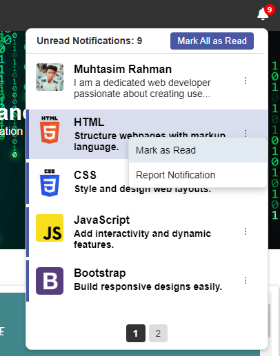

# Custom Notification Panel

## A Dynamic and Interactive Notification Management System

A modern, feature-rich **Notification Panel** built using HTML, CSS, and JavaScript, with **Google Sheets** serving as the backend for managing notifications. This project provides an intuitive and visually appealing way to display and interact with notifications on any website.

---

## 🚀 Features

- **Dynamic Notification Loading**: Notifications are fetched from a Google Sheet and displayed dynamically on the website.
- **Interactive Controls**:
  - Mark notifications as read/unread.
  - Report notifications with ease.
- **Pagination Support**: Efficiently displays notifications in pages for better user experience.
- **Unread Badge Count**: Displays the number of unread notifications in real-time.
- **Customizable Menu Options on Sheet**: Includes dropdown menus for additional actions.
- **Responsive UI/UX**: Works flawlessly across devices with a modern design.
- **Local Storage Integration**: Retains read/unread status locally for user convenience.

---

## 🛠️ Technologies Used

- **Frontend**: HTML, CSS, JavaScript
- **Backend**: Google Sheets (using Google Apps Script)
- **Icons**: Font Awesome for professional notification icons
- **Storage**: Local Storage for managing user interactions

---

## ⚙️ How It Works

1. **Google Sheets as Backend**:

- A Google Sheet is set up to store all notification data, including image URLs, titles, descriptions, links, and statuses.
- Data is fetched via Google Apps Script, exposed as a JSON endpoint.

2. **Frontend Integration**:

- The JavaScript script fetches data from the Google Sheets endpoint.
- Notifications are displayed dynamically with sorting and filtering options.

3. **Local Storage**:

- Read/unread status is saved locally for persistent user experience.

---

## Installation

### |(----: Coming Soon :----)|
